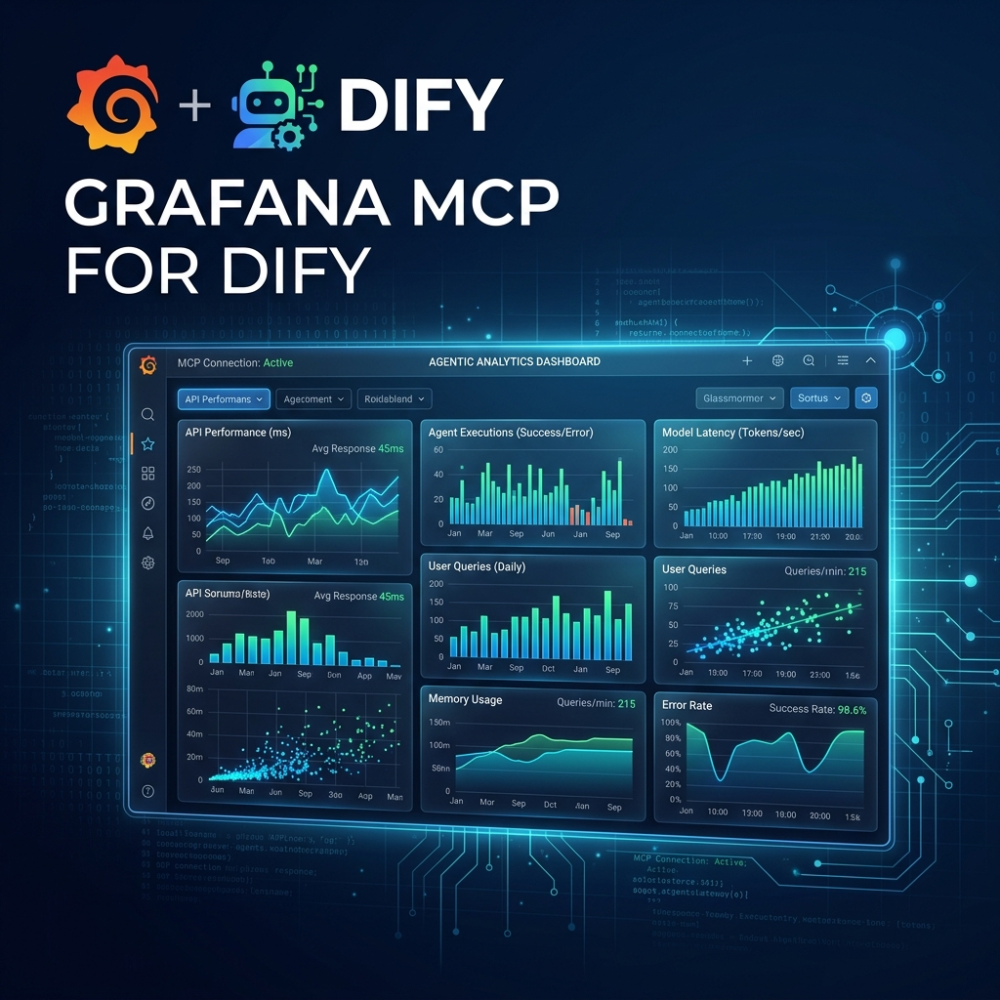

# Grafana MCP Plugin for Dify



This plugin wraps the [Grafana MCP server](https://github.com/grafana/mcp-grafana) to provide advanced Grafana capabilities directly within Dify. It uses the Model Context Protocol (MCP) to communicate with the Grafana server, ensuring full compatibility and access to the latest features.

## Features

- **Search Dashboards**: Find dashboards by title, tags, or starred status.
- **Get Dashboard Summary**: Get a high-level summary of a dashboard's content.
- **Get Dashboard Properties**: Retrieve the full JSON definition of a dashboard.
- **Get Panel Queries**: Extract data source queries for panels.
- **Query Prometheus**: Execute PromQL queries.
- **Query Loki**: Execute LogQL queries.
- **List Datasources**: List all configured datasources.

## Configuration

To use this plugin, you need:

1. **Grafana URL**: The base URL of your Grafana instance (e.g., `https://grafana.example.com`).
2. **Service Account Token**: A Grafana Service Account token with appropriate permissions (Viewer or Editor, depending on what you want the agent to do).

## Installation & Testing

### Local Testing
Before publishing, you can test the plugin connection locally:

1.  **Install Dependencies**:
    ```bash
    pip install -r requirements.txt
    ```
2.  **Set Environment Variables**:
    ```bash
    export GRAFANA_URL="https://your-instance.grafana.net"
    export GRAFANA_SERVICE_ACCOUNT_TOKEN="glsa_..."
    ```
3.  **Run Test Script**:
    ```bash
    python test_connection.py
    ```

### Dify Installation
1. Package the plugin folder as a `.zip` or use the Dify CLI to install.
2. In Dify, go to **Plugins** -> **Install from File**.
3. Configure the credentials in the tool provider settings.

## Publishing to Dify Marketplace

This repository is configured for automatic publication via GitHub Actions.

1. **Fork** the [dify-plugins](https://github.com/langgenius/dify-plugins) repository.
2. Add a **GitHub Secret** named `PLUGIN_ACTION` to this repository with your Personal Access Token (PAT).
3. Push changes to the `main` branch.
4. The workflow will automatically package the plugin and create a PR to the marketplace repository.

## License

This project is licensed under the MIT License - see the [LICENSE](LICENSE) file for details.

## Author

Created by [nise-ua](https://github.com/nise-ua).
